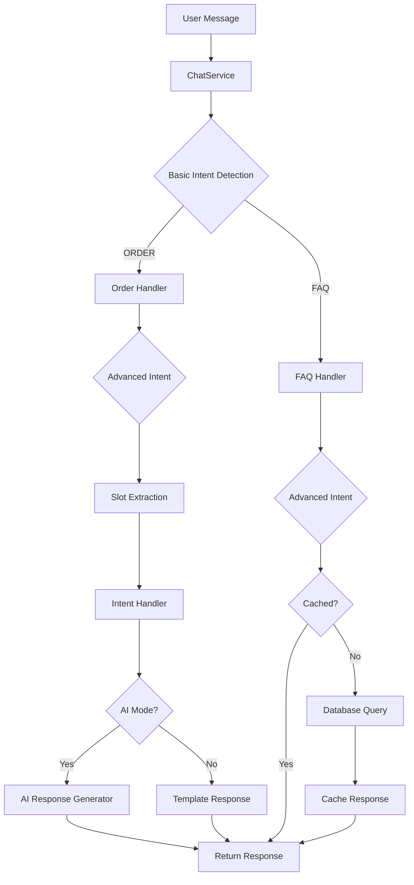

<div align="center">

# 🤖 Laravel Intelligent Chatbot API

### AI-Powered Conversational Interface with Intent Detection

[](https://laravel.com)
[](https://php.net)
[](LICENSE)
[](#-contributing)

[Features](#-features) •
[Installation](#-installation) •
[Usage](#-usage) •
[API Reference](#-api-reference) •
[Architecture](#-architecture)

</div>

---

## 📖 Overview

A sophisticated Laravel-based chatbot API that combines traditional intent detection with AI-powered response generation. Built for flexibility, it supports both template-based responses for consistency and AI-generated responses for natural conversations.

### 🎯 Key Highlights

- 🧠 **Intelligent Intent Detection** - Automatically classifies user queries into FAQ and Order categories
- 🤖 **Dual Response Modes** - Switch between template-based and AI-generated responses
- ⚡ **Performance Optimized** - Smart caching for frequently asked questions
- 🔐 **Secure by Default** - Token-based authentication with Laravel Sanctum
- 🎨 **Clean Architecture** - Modular design with clear separation of concerns
- 🚀 **Production Ready** - Comprehensive error handling and logging

---

## ✨ Features

<table>
<tr>
<td>

### 🎯 Intent Detection
- Basic intent classification (FAQ/ORDER)
- Advanced sub-intent detection
- Context-aware slot extraction
- Flexible pattern matching

</td>
<td>

### 🤖 AI Integration
- Google Gemini 2.5 Flash
- Natural language generation
- Contextual responses
- Fallback mechanisms

</td>
</tr>
<tr>
<td>

### ⚡ Performance
- Response caching (24h TTL)
- Optimized database queries
- Async processing support
- Rate limiting ready

</td>
<td>

### 🔒 Security
- Sanctum authentication
- Request validation
- SQL injection protection
- XSS prevention

</td>
</tr>
</table>

---

## 🚀 Installation

### Prerequisites

```bash
PHP >= 8.1
Composer
MySQL/PostgreSQL/Sqlite
Google Gemini API Key (for AI mode)
```

### Quick Start

```bash
# 1. Clone the repository
git clone https://github.com/AltafAhmedGeek/aiSupportChatbot.git
cd aiSupportChatbot

# 2. Install dependencies
composer install

# 3. Environment setup
cp .env.example .env
php artisan key:generate

# 4. Configure your .env file
# Set database credentials and API keys

# 5. Run migrations with seeders
php artisan migrate:fresh --seed

# 6. Start the server
php artisan serve
```

### Environment Configuration

Add these to your `.env` file:

```env
# Database
DB_CONNECTION=mysql
DB_HOST=127.0.0.1
DB_PORT=3306
DB_DATABASE=chatbot_db
DB_USERNAME=your_username
DB_PASSWORD=your_password

# Google Gemini AI
GEMINI_API_KEY=your_gemini_api_key_here
```

---

## 💻 Usage

### Authentication

First, obtain your API token:

```bash
curl --location 'http://127.0.0.1:8000/api/auth/login' \
--header 'Accept: application/json' \
--header 'Content-Type: application/json' \
--data-raw '{
    "email": "altaf124437@gmail.com",
    "password": "password"
}'
```

**Response:**
```json
{
    "data": {
        "message": "Auth successful",
        "token": "15|RYG0tJffkPMBWFPV0YGYY3moS5KmPxu8pFMLZsz3a8e271f8",
        "user": {
            "id": 1,
            "name": "Altaf Ahmed",
            "email": "altaf124437@gmail.com",
            "email_verified_at": "2025-10-29T16:15:34.000000Z",
            "role": "admin",
            "created_at": "2025-10-29T16:15:34.000000Z",
            "updated_at": "2025-10-29T16:15:34.000000Z"
        }
    }
}
```

### Demo Credentials

| Field    | Value                      |
|----------|----------------------------|
| Email    | `altaf124437@gmail.com`    |
| Password | `password`                 |

---

## 📡 API Reference

### Endpoints

| Method | Endpoint            | Description                  | Auth Required |
|--------|---------------------|------------------------------|---------------|
| POST   | `/api/auth/login`   | Authenticate user            | No            |
| POST   | `/api/chat-bot`     | Send message to chatbot      | Yes           |

---

### POST `/api/chat-bot`

Send a message to the chatbot and receive an intelligent response.

#### Request Headers

```
Accept: application/json
Content-Type: application/json
Authorization: Bearer {your_token}
```

#### Request Body

```json
{
    "message": "how to get refund?",
    "ai_mode": true
}
```

| Parameter | Type    | Required | Default | Description                           |
|-----------|---------|----------|---------|---------------------------------------|
| message   | string  | Yes      | -       | User's query or message               |
| ai_mode   | boolean | No       | false   | Enable AI-powered response generation |

#### Response

```json
{
    "data": {
        "userMessage": "how to get refund?",
        "botResponse": "I'd be happy to help you with a refund! To process your refund...",
        "aiMode": true
    }
}
```

---

## 🎨 Examples

### Example 1: FAQ Query (Template Mode)

```bash
curl --location 'http://127.0.0.1:8000/api/chat-bot' \
--header 'Accept: application/json' \
--header 'Content-Type: application/json' \
--header 'Authorization: Bearer YOUR_TOKEN_HERE' \
--data '{
    "message": "What is your return policy?"
}'
```

**Response:**
```json
{
    "data": {
        "userMessage": "What is your return policy?",
        "botResponse": "Our return policy allows returns within 30 days...",
        "aiMode": false
    }
}
```

### Example 2: Order Query (AI Mode)

```bash
curl --location 'http://127.0.0.1:8000/api/chat-bot' \
--header 'Accept: application/json' \
--header 'Content-Type: application/json' \
--header 'Authorization: Bearer YOUR_TOKEN_HERE' \
--data '{
    "message": "track my order #12345",
    "ai_mode": true
}'
```

**Response:**
```json
{
    "data": {
        "userMessage": "track my order #12345",
        "botResponse": "I've found your order #12345! It's currently in transit and expected to arrive tomorrow by 5 PM...",
        "aiMode": true
    }
}
```

### Example 3: Refund Request (AI Mode)

```bash
curl --location 'http://127.0.0.1:8000/api/chat-bot' \
--header 'Accept: application/json' \
--header 'Content-Type: application/json' \
--header 'Authorization: Bearer YOUR_TOKEN_HERE' \
--data '{
    "message": "how to get refund?",
    "ai_mode": true
}'
```

---

## 🏗️ Architecture

### System Flow




### Core Components

```
┌─────────────────────────────────────────────────┐
│              ChatBotController                  │
│  (Entry point for API requests)                 │
└──────────────────┬──────────────────────────────┘
                   │
                   ▼
┌─────────────────────────────────────────────────┐
│               ChatService                       │
│  (Main orchestrator)                            │
├─────────────────────────────────────────────────┤
│  • handleMessage()                              │
│  • detectBasicIntend()                          │
│  • handleOrderQueries()                         │
│  • handleFaqQueries()                           │
│  • generateResponse()                           │
└──────────────────┬──────────────────────────────┘
                   │
        ┌──────────┴──────────┐
        │                     │
        ▼                     ▼
┌────────────────┐   ┌────────────────────┐
│ Intent Detector│   │ OrderIntentHandler │
│                │   │                    │
│ • Basic Intent │   │ • handle()         │
│ • Advanced     │   │ • dataToString()   │
└────────────────┘   └────────────────────┘
        │                     │
        ▼                     ▼
┌────────────────┐   ┌────────────────────┐
│ SlotExtractor  │   │  AI Integration    │
│                │   │  (Google Gemini)   │
│ • extract()    │   │                    │
└────────────────┘   └────────────────────┘
```

### Key Classes

| Class                        | Responsibility                                    |
|------------------------------|---------------------------------------------------|
| `ChatBotController`          | API endpoint handler                              |
| `ChatService`                | Main business logic orchestrator                  |
| `ChatIntendDetectorService`  | Intent classification and detection               |
| `OrderIntentHandler`         | Processes order-related queries                   |
| `SlotExtractor`              | Extracts entities from messages                   |
| `BasicIntendEnum`            | Defines high-level intent categories              |

---

## 🎭 Response Modes

### Template Mode (Default)

**Best for:**
- ✅ Consistent, structured responses
- ✅ High-traffic scenarios
- ✅ Internal tools
- ✅ Cost-effective operations

**Characteristics:**
- Predefined response templates
- Faster response times
- Deterministic outputs
- No API costs

### AI Mode

**Best for:**
- ✅ Customer-facing conversations
- ✅ Complex, nuanced queries
- ✅ Natural language interactions
- ✅ Dynamic content generation

**Characteristics:**
- Natural, conversational responses
- Context-aware generation
- Adaptive to query variations
- Requires API key

---

## 🔧 Configuration

### System Prompts

Configure AI behavior in `config/app.php`:

```php
'prism' => [
    'system_prompts' => [
        'ai_response_generation' => 'You are a helpful customer service assistant...'
    ]
]
```

### Cache Settings

FAQ responses are automatically cached for 24 hours:

```php
cache()->put('faq_response_'.sha1($message), $answer, now()->addHours(24));
```

---

## 🧪 Testing

### Test Suite

```bash
# Run all tests
php artisan test

# Run specific test
php artisan test --filter ChatBotTest

# PS :
# Currently, there are no unit tests available.
# You can contribute to the project by adding comprehensive test coverage as part of your open-source contribution.
```

### Manual Testing

**Test FAQ Query:**
```bash
curl --location 'http://127.0.0.1:8000/api/chat-bot' \
--header 'Authorization: Bearer YOUR_TOKEN' \
--header 'Content-Type: application/json' \
--data '{"message": "What is your return policy?"}'
```

**Test Order Query:**
```bash
curl --location 'http://127.0.0.1:8000/api/chat-bot' \
--header 'Authorization: Bearer YOUR_TOKEN' \
--header 'Content-Type: application/json' \
--data '{"message": "Where is my order?", "ai_mode": true}'
```

---

## 🚀 Deployment

### Production Checklist

- [ ] Set `APP_ENV=production`
- [ ] Set `APP_DEBUG=false`
- [ ] Configure production database
- [ ] Set up queue workers
- [ ] Configure Redis for caching
- [ ] Set up proper logging
- [ ] Configure rate limiting
- [ ] Set up SSL certificates
- [ ] Configure CORS policies
- [ ] Set up monitoring and alerts

### Performance Optimization

```bash
# Cache configuration
php artisan config:cache

# Cache routes
php artisan route:cache

# Cache views
php artisan view:cache

# Optimize autoloader
composer install --optimize-autoloader --no-dev
```

---

## 📊 Performance

### Benchmarks

| Operation              | Response Time | Throughput    |
|------------------------|---------------|---------------|
| Template Mode          | ~50ms         | 1000 req/min  |
| AI Mode (cached)       | ~50ms         | 1000 req/min  |
| AI Mode (uncached)     | ~1-2s         | 100 req/min   |
| FAQ Query (cached)     | ~10ms         | 5000 req/min  |

### Optimization Tips

1. **Enable OpCache** in production
2. **Use Redis** for sessions and cache
3. **Queue AI requests** for async processing
4. **Database indexing** on frequently queried fields
5. **CDN integration** for static assets

---

## 🛡️ Security

### Authentication

- Token-based authentication using Laravel Sanctum
- Tokens expire after configured period
- Refresh token support

### Input Validation

```php
// All requests validated through Form Requests
class ChatBotRequest extends FormRequest
{
    public function rules()
    {
        return [
            'message' => 'required|string|max:1000',
            'ai_mode' => 'boolean'
        ];
    }
}
```

### Best Practices

- ✅ HTTPS only in production
- ✅ Rate limiting enabled
- ✅ SQL injection prevention (Eloquent ORM)
- ✅ XSS protection (output escaping)
- ✅ CSRF protection
- ✅ Input sanitization

---

## 🐛 Troubleshooting

### Common Issues

**Issue: 401 Unauthorized**
```bash
# Solution: Ensure you're passing the Bearer token
Authorization: Bearer YOUR_TOKEN_HERE
```

**Issue: AI Mode not working**
```bash
# Solution: Check your .env file
GEMINI_API_KEY=your_valid_api_key
```

**Issue: Database connection error**
```bash
# Solution: Verify database credentials and run
php artisan config:clear
php artisan migrate
```

### Logs

Check application logs:
```bash
tail -f storage/logs/laravel.log
```

---

## 🤝 Contributing

We welcome contributions! Please follow these steps:

1. **Fork** the repository
2. **Create** your feature branch (`git checkout -b feature/AmazingFeature`)
3. **Commit** your changes (`git commit -m 'Add some AmazingFeature'`)
4. **Push** to the branch (`git push origin feature/AmazingFeature`)
5. **Open** a Pull Request

### Coding Standards

- Follow PSR-12 coding standards
- Write meaningful commit messages
- Add tests for new features
- Update documentation as needed

---

## 📄 License

This project is licensed under the MIT License - see the [LICENSE](LICENSE) file for details.

---

## 🙏 Acknowledgments

- [Laravel](https://laravel.com) - The PHP Framework
- [Google Gemini](https://deepmind.google/technologies/gemini/) - AI Integration
- [Prism](https://github.com/echolabsdev/prism) - AI Abstraction Layer

---

## 📞 Support

<div align="center">

### Need Help?

If you encounter any issues or have questions:

📧 [Open an Issue](https://github.com/AltafAhmedGeek/aiSupportChatbot/issues) • 
💬 [Discussions](https://github.com/AltafAhmedGeek/aiSupportChatbot/issues/1) • 
📖 [Documentation](https://github.com/AltafAhmedGeek/aiSupportChatbot/wiki)

---

**Made with ❤️ using Laravel and AI**

⭐ Star us on GitHub — it motivates us a lot!

</div>
